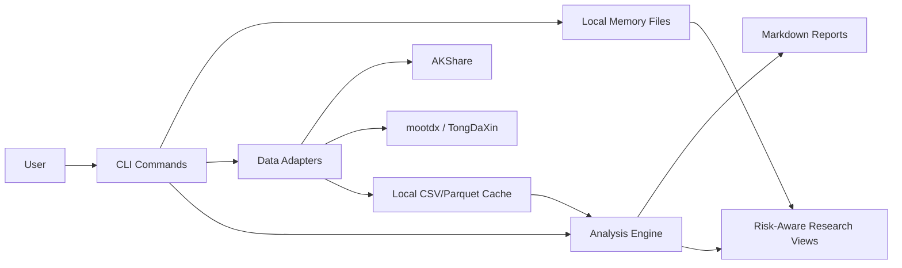

# A/H Share AI Investment Advisor Design

Created: 2026-06-16
Workspace: `C:\Users\Cindy\Desktop\Finance\AI金融`

## Goal

Build a local AI investment research assistant for A shares and Hong Kong shares. The assistant reads K-line data, ranks sectors and themes, produces explainable investment research views, and keeps persistent local memory across sessions.

This system is a research and decision-support tool. It must not place trades automatically, must not promise returns, and must attach risk notes to every recommendation.

## First MVP

The first version should provide:

- A command line interface that can refresh market data, analyze sectors, analyze one stock, and generate a Markdown research report.
- A data layer that uses AKShare as the default source and reserves adapters for TongDaXin local data through mootdx.
- A memory layer inspired by the reference image: `CLAUDE.md`, `Memory.md`, `Learning.md`, and `Wiki.md`.
- A transparent scoring model that separates trend, volume, breadth, volatility, and risk signals.
- A local project layout that can later be exposed as an MCP server or a Streamlit dashboard.

## Non-Goals

- No automatic order placement.
- No brokerage login, cookie scraping, or account credential storage.
- No intraday high-frequency trading.
- No claim that AI output is financial advice.
- No dependency on paid data during the MVP.

## Data Sources

### Default Source: AKShare

AKShare is the MVP default because it can fetch A-share historical K-line data, Hong Kong share data, and Eastmoney sector/concept board data through Python. It also works well with pandas and local caching.

Required AKShare capabilities:

- A-share daily K-line: `stock_zh_a_hist`
- Concept board ranking: `stock_board_concept_name_em`
- Industry board ranking: `stock_board_industry_name_em`
- Hong Kong share K-line where available from AKShare, with yfinance fallback for Hong Kong tickers when needed.

### TongDaXin Adapter: mootdx

mootdx should be optional in the MVP because the local TongDaXin path is not yet known. The adapter should support:

- Reading offline daily K-line data from a configured TongDaXin directory.
- Reading minute K-line data if local files exist.
- Reporting a clear setup error if the configured directory does not exist.

Default candidate paths were checked and not found:

- `C:\new_tdx`
- `C:\tdx`
- `D:\new_tdx`
- `D:\tdx`

### TongHuaShun

TongHuaShun local data formats vary more by installation and version. The MVP should not depend on local TongHuaShun files. Public data interfaces and qstock-style ideas can be revisited later for WenCai-style screening, but only after the basic data pipeline is stable.

## Architecture

## Components

### CLI

The CLI exposes user-facing commands:

- `refresh`: fetch and cache current sector and selected stock data.
- `sector`: rank concept and industry boards.
- `stock`: analyze one A-share or H-share symbol.
- `report`: generate a Markdown market report.
- `memory`: append session notes to local memory files.

### Config

Configuration lives in `config/settings.toml`.

Core settings:

- `data_source`: `akshare` or `tdx`
- `tdx_path`: optional TongDaXin install path
- `cache_dir`: local data cache directory
- `report_dir`: output report directory
- `market`: `a_share`, `hk_share`, or `both`

### Data Layer

The data layer returns normalized pandas DataFrames with stable column names:

- `date`
- `open`
- `high`
- `low`
- `close`
- `volume`
- `amount`
- `turnover`
- `pct_change`
- `source`

Each adapter is responsible for mapping source-specific names to these names.

### Analysis Engine

The first scoring model uses interpretable factors:

- Trend: close relative to moving averages and moving-average slope.
- Momentum: recent percentage change over 5, 20, and 60 trading days.
- Volume: recent volume compared with 20-day average volume.
- Breadth: rising count versus falling count for sectors where source data provides it.
- Volatility: recent drawdown and rolling return volatility.
- Risk flags: sharp run-up, high volatility, low liquidity, missing data, and stale data.

Outputs should include both score and explanation. A typical recommendation is a research category such as:

- `watch`
- `avoid_for_now`
- `strong_sector_watchlist`
- `pullback_wait`
- `risk_control_required`

### Reports

Reports are Markdown files under `reports/`.

Each report includes:

- Data timestamp and source.
- Market summary.
- Top industry boards.
- Top concept boards.
- Watchlist candidates.
- Risk flags.
- Memory references used during analysis.
- Disclaimer.

### Memory

The memory files are intentionally simple Markdown so they can be inspected and edited by hand.

- `CLAUDE.md`: project rules, role definition, and operating constraints loaded at session start.
- `memory/Memory.md`: durable user preferences, portfolio assumptions, preferred markets, and recurring watchlists.
- `memory/Learning.md`: mistakes, data quirks, model changes, and lessons learned.
- `memory/Wiki.md`: shared definitions such as A-share board names, factor definitions, and symbol conventions.

The MVP includes scripts that can append session summaries and learning notes. Full automatic hooks can be added after the CLI works.

## Error Handling

The system should fail loudly and explain next steps when:

- Network data cannot be fetched.
- AKShare changes a column name.
- The configured TongDaXin path does not exist.
- A symbol is unsupported.
- Data is stale or too short for a requested factor.

Reports should include data quality warnings instead of silently hiding bad data.

## Testing Strategy

The first test layer uses small fixture DataFrames so scoring and normalization can be verified without network access.

Tests should cover:

- K-line normalization from AKShare-style columns.
- TDX path validation.
- Moving average and momentum calculation.
- Sector ranking sort order.
- Report generation with required sections.
- Memory append behavior.

Network-dependent integration checks should be manual first, because public finance endpoints can change or rate-limit.

## Security and Compliance

- Store no brokerage credentials.
- Do not scrape private account pages.
- Do not execute trades.
- Treat all public data as potentially delayed or incomplete.
- Every generated report includes the line: `This is research support, not financial advice.`

## Acceptance Criteria

The MVP is complete when:

- `python -m ai_invest_advisor.cli sector --top 10` ranks current concept or industry boards when network access is available.
- `python -m ai_invest_advisor.cli stock 600036 --market a_share` produces a structured stock analysis report.
- `python -m ai_invest_advisor.cli report --market both` writes a Markdown report to `reports/`.
- Unit tests pass without network access.
- Memory files exist and can be updated through the CLI.
- Missing TongDaXin installation paths produce an actionable message rather than a crash.

